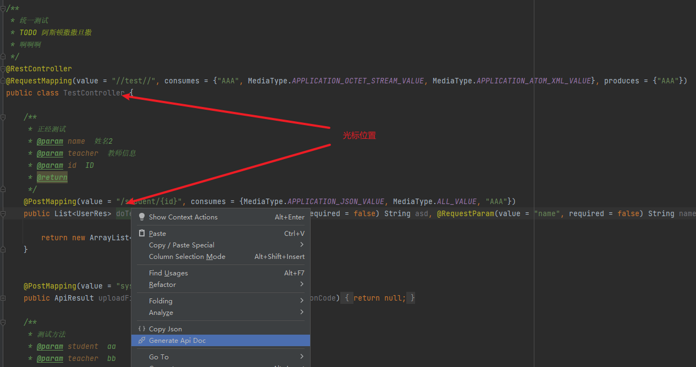
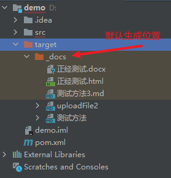
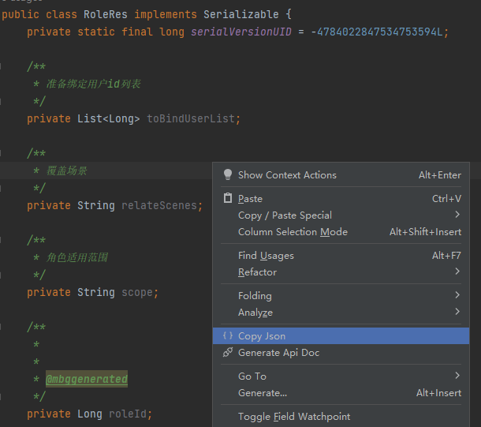
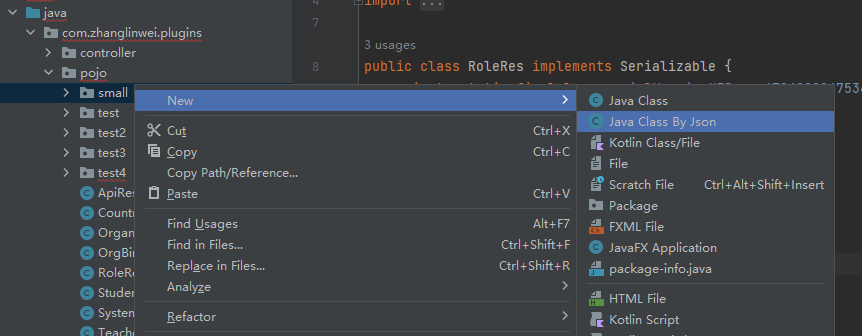
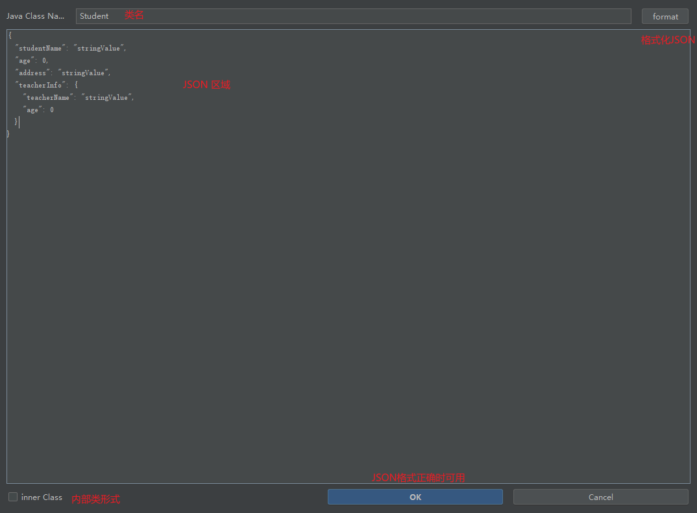
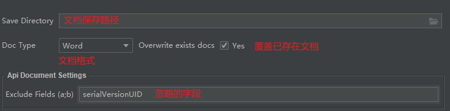

# zTools

有 Bug 请留言，会尽快优化

## 一、开发环境

- `IntelliJ IDEA 2023.1.2` 旗舰版
- `JDK17`
- `gradle-8.1.1-bin.zip`

## 二、功能描述

### 1、生成接口文档

支持三种格式：`Word`、`MarkDown`、`Html`

**使用方式：**

1. 将鼠标定位至 **接口范围内** 或 **类名** 上
2. 鼠标右键单机，在弹出的页面选择 `Generate Api Doc`
3. 若未配置文档保存路径，默认在项目根目录 `/target/_doc` 内

#### 注意事项

1. 日常开发常用 RestFul 风格基本都支持
2. 对于 **未标注注解的参数：** 
   1. `GET` 和 `DELETE` 请求默认为 **查询参数** 
   2. `POST` 和 `PUT` 请求默认为 **表单参数** 
3. 如果方法允许多种请求类型，所有未注释的参数将被忽略
4. 如果使用对象接收 `Query`、`Path` 和 `Form` 参数，则只会解析对象的第一级

#### 注解支持

~~~java
@Controller
@RestController

@RequestMapping
@GetMapping
@PutMapping
@DeleteMapping
@PatchMapping

@RequestBody
@ResponseBody
@RequestParam
@PathVariable
@RequestHeader
@RequestPart

@ApiOperation
@ApiModelProperty

@JsonFormat
@JsonIgnore
~~~

### 2、拷贝 JSON

将 `Java` 类转为 `JSON` 字符串，支持任意嵌套

**使用方式：**

1. 光标定位至类区域内
2. 鼠标右键单机
3. 选择 `Copy Json`

#### 注意事项

1. 默认会忽略 `static`、`final` 字段
2. 默认会忽略 `serialVersionUID` 字段
3. 自引用的嵌套类型会标注 **同外层** 

~~~java
@Data
public class Student {

    private String studentName;

    private Long age;

    private String address;

    private Student studnetInfo; // 自引用

}
~~~

生成 `JSON` 如下

~~~json
{
  "studentName": "stringValue",
  "age": 0,
  "address": "stringValue",
  "studnetInfo": {} // 同外层
}
~~~

### 3、JSON 转 Java类

根据 `JSON` 字符串生成 `Java` 类，支持 **内部类、新文件** 两种方式

**使用方式：**

1. 选中要生成的包
2. 右键 `==> new ==> Java Class by Json`
3. 在弹出的对话框输入 `JSON`

#### 注意事项

**1、嵌套形式**

~~~json
// Student
{
  "studentName": "stringValue",
  "age": 0,
  "address": "stringValue",
  "studnetInfo": {
    "studentName": "stringValue",
    "age": 0,
    "address": "stringValue",
    "studnetInfo": {}
  }
}
~~~

生成的类为

~~~java
@Data
public class Student {

    private String studentName;

    private Long age;

    private String address;

    private Student studnetInfo; // 自引用

}
~~~

**2、空对象**

~~~json
// Student
{
  "studentName": "stringValue",
  "age": 0,
  "address": "stringValue",
  "studnetInfo": {}
}
~~~

生成的类为

~~~java
@Data
public class Student {

    private String studentName;

    private Long age;

    private String address;

    private Map<String, Object> studnetInfo; // 注意这里

}
~~~

**3、重复 key**

~~~json
// Student
{
  "studentName": "stringValue",
  "age": 0,
  "address": "stringValue",
  "teacherInfo": { // 这里重复, 但对象内的key不同
    "teacherName": "stringValue",
    "teacherInfo": { // 这里重复, 但对象内的key不同
      "teacherName": "stringValue",
      "age": 1
    }
  }
}
~~~

生成的类为

~~~java
// 类一
@Data
public class Student {

    private String studentName;

    private Long age;

    private String address;

    private TeacherInfo teacherInfo;

}

// 类二
@Data
public class TeacherInfo {

    private String teacherName;

    private TeacherInfo_drvE teacherInfo; // 看这里

}

// 类三
@Data
public class TeacherInfo_drvE {

    private String teacherName;

    private Long age;

}
~~~

## 三、配置说明

