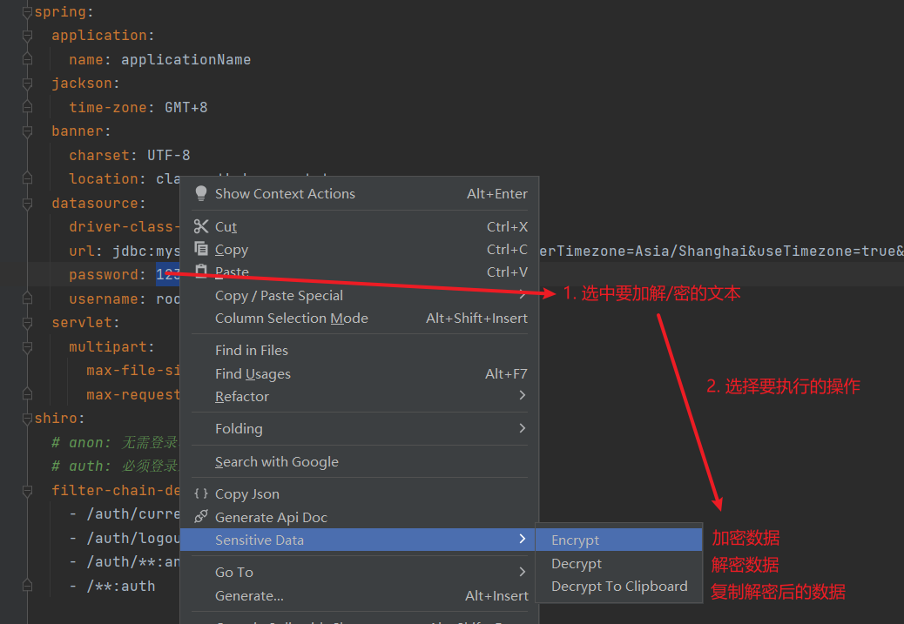
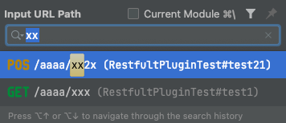
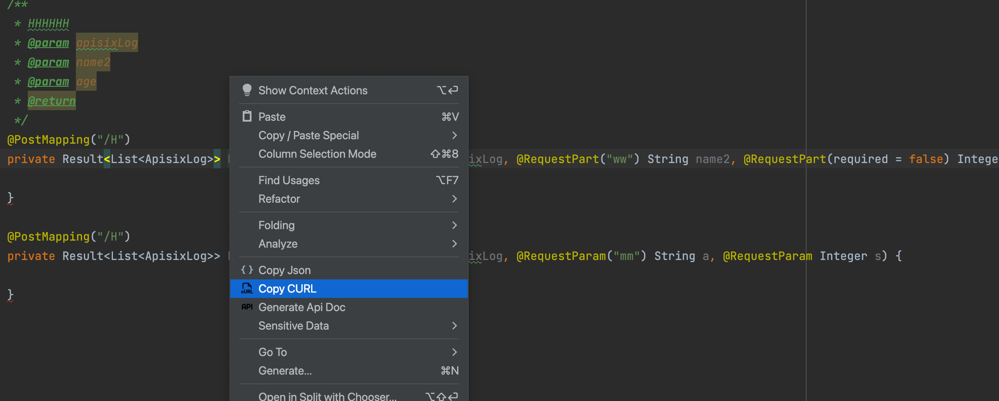
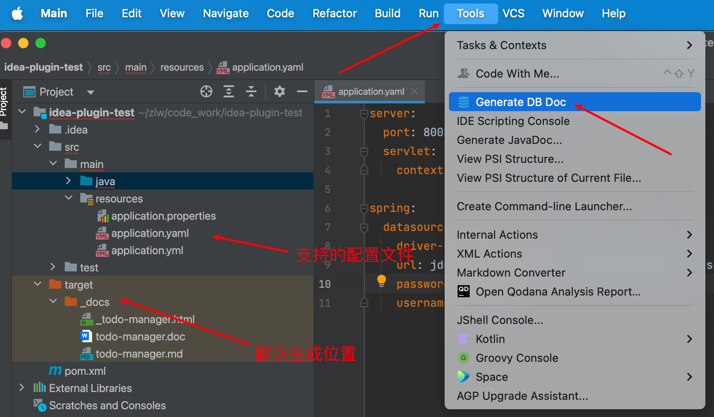
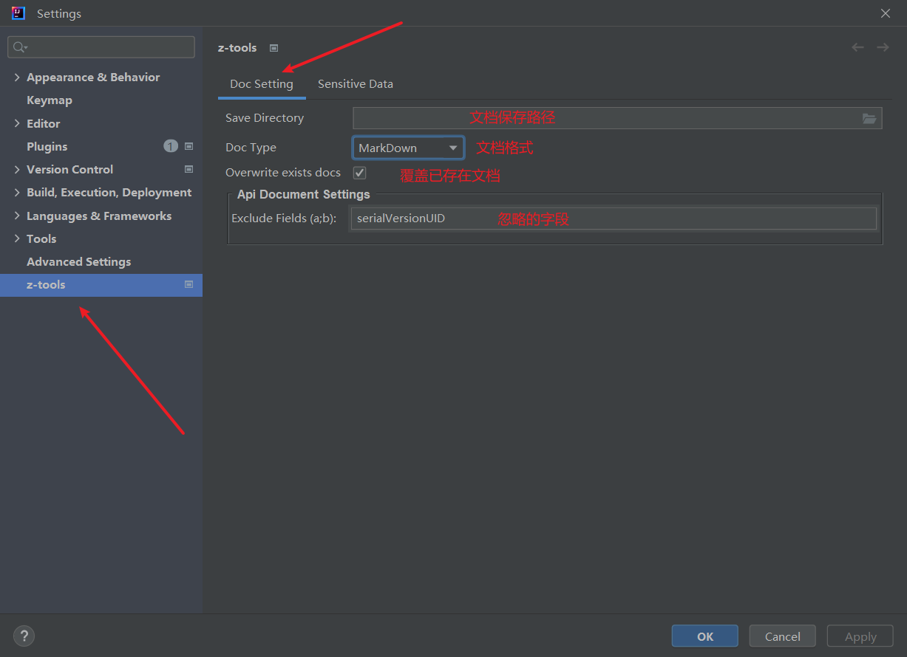
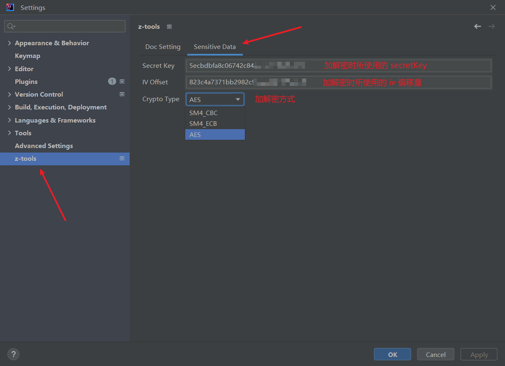

# zTools

有 Bug 请留言，会尽快优化

## 一、开发环境

- `IntelliJ IDEA 2023.1.2` 旗舰版
- `JDK17`
- `gradle-8.1.1-bin.zip`

## 二、功能描述

### 1、生成接口文档

支持三种格式：`Word`、`MarkDown`、`Html`

**使用方式：**

1. 将鼠标定位至 **接口范围内** 或 **类名** 上
2. 鼠标右键单机，在弹出的页面选择 `Generate Api Doc`
3. 若未配置文档保存路径，默认在项目根目录 `/target/_doc` 内（若未显示，请前往本地磁盘内查看，IDEA有时不会实时刷新）


#### 注意事项

1. 日常开发常用 RestFul 风格基本都支持
2. 对于 **未标注注解的参数：** 
   1. `GET` 和 `DELETE` 请求默认为 **查询参数** 
   2. `POST` 和 `PUT` 请求默认为 **表单参数** 
3. 如果方法允许多种请求类型，所有未注释的参数将被忽略
4. 如果使用对象接收 `Query`、`Path` 和 `Form` 参数，则只会解析对象的第一级
5. 如果出现中文乱码需全局设置 IDEA 的编码为 UTF-8

#### 注解支持

~~~java
@Controller
@RestController

@RequestMapping
@GetMapping
@PutMapping
@DeleteMapping
@PatchMapping

@RequestBody
@ResponseBody
@RequestParam
@PathVariable
@RequestHeader
@RequestPart

@ApiOperation
@ApiModelProperty

@JsonFormat
@JsonIgnore
~~~

### 2、拷贝 JSON

将 `Java` 类转为 `JSON` 字符串，支持任意嵌套

**使用方式：**

1. 光标定位至类区域内
2. 鼠标右键单机
3. 选择 `Copy Json`


#### 注意事项

1. 默认会忽略 `static` 字段
2. 默认会忽略 `serialVersionUID` 字段
3. 自引用的嵌套类型会标注 **同外层** 

~~~java
@Data
public class Student {

    private String studentName;

    private Long age;

    private String address;

    private Student studnetInfo; // 自引用

}
~~~

生成 `JSON` 如下

~~~json
{
  "studentName": "stringValue",
  "age": 0,
  "address": "stringValue",
  "studnetInfo": {} // 同外层
}
~~~

### 3、JSON 转 Java类

根据 `JSON` 字符串生成 `Java` 类，支持 **内部类、新文件** 两种方式

**使用方式：**

1. 选中要生成的包
2. 右键 `==> new ==> Java Class by Json`
3. 在弹出的对话框输入 `JSON`


#### 注意事项

**1、嵌套形式**

~~~json
// Student
{
  "studentName": "stringValue",
  "age": 0,
  "address": "stringValue",
  "studnetInfo": {
    "studentName": "stringValue",
    "age": 0,
    "address": "stringValue",
    "studnetInfo": {}
  }
}
~~~

生成的类为

~~~java
@Data
public class Student {

    private String studentName;

    private Long age;

    private String address;

    private Student studnetInfo; // 自引用

}
~~~

**2、空对象**

~~~json
// Student
{
  "studentName": "stringValue",
  "age": 0,
  "address": "stringValue",
  "studnetInfo": {}
}
~~~

生成的类为

~~~java
@Data
public class Student {

    private String studentName;

    private Long age;

    private String address;

    private Map<String, Object> studnetInfo; // 注意这里

}
~~~

**3、重复 key**

~~~json
// Student
{
  "studentName": "stringValue",
  "age": 0,
  "address": "stringValue",
  "teacherInfo": { // 这里重复, 但对象内的key不同
    "teacherName": "stringValue",
    "teacherInfo": { // 这里重复, 但对象内的key不同
      "teacherName": "stringValue",
      "age": 1
    }
  }
}
~~~

生成的类为

~~~java
// 类一
@Data
public class Student {

    private String studentName;

    private Long age;

    private String address;

    private TeacherInfo teacherInfo;

}

// 类二
@Data
public class TeacherInfo {

    private String teacherName;

    private TeacherInfo_drvE teacherInfo; // 看这里

}

// 类三
@Data
public class TeacherInfo_drvE {

    private String teacherName;

    private Long age;

}
~~~

### 4、加解/密敏感数据

将选中的文本加 / 解密，配套项目 [crypto-tools](https://gitee.com/linwei-zhang/crypto-tools)

> 若使用此配套项目，续修改项目内默认的 secretKey 与 iv，保证其与插件配置一致

**使用方式：**

1. 选中要加 / 解密的文本
2. 鼠标右键单机
3. 选择 `Encrypt`、`Decrypt`、`Decrypt To Clipboard`



### 5、搜索并跳转 Restful 接口

快捷键 `Ctrl + \`



#### 注意事项

1. 如果修改了相关配置，需要重启项目（重新构建）才能生效，否则读取的还是旧的配置

2. 配置请规范书写，否则可能无法解析

3. 全局请求前缀说明:

   - 支持 `server.servlet.context-path`、`spring.mvc.servlet.path` 属性

   - 优先级 `server.servlet.context-path > spring.mvc.servlet.path`


4. 配置文件读取说明：

   - 支持`application.yaml`、`application.yml`、`application.properties`

   - 优先级`application.yaml > application.yml > application.properties`


### 6、拷贝 cURL

将 `Restful` 接口复制为 `cURL` 命令，可直接导入`Postman`

**使用方式：**

1. 光标定位至方法区域内
2. 鼠标右键单机
3. 选择 `Copy CURL`



### 7、生成数据库文档

支持三种格式：`Word`、`MarkDown`、`Html`

**使用方式：**

1. 鼠标左键单击菜单栏 `Tools ==> Generate DB Doc`
2. 若未配置文档保存路径，默认在项目根目录 `/target/_doc` 内（若未显示，请前往本地磁盘内查看，IDEA有时不会实时刷新）



#### 支持数据库

1. MySQL

#### 注意事项

1. 会自动读取配置文件内的数据库配置，如果修改了相关配置，需要重启项目（重新构建）才能生效，否则读取的还是旧的配置

2. 配置请规范书写，否则可能无法解析

3. 读取配置项说明:

```yaml
# yaml、yml
spring:
  datasource:
    driver-class-name: com.mysql.cj.jdbc.Driver
    url: jdbc:mysql://127.0.0.1:3306/todo-manager?serverTimezone=Asia/Shanghai&useTimezone=true&charset=utf8mb4&useSSL=false&allowPublicKeyRetrieval=true
    password: xxxxxxx
    username: root

# properties
spring.datasource.driver-class-name: com.mysql.cj.jdbc.Driver
spring.datasource.url: jdbc:mysql://127.0.0.1:3306/todo-manager?serverTimezone=Asia/Shanghai&useTimezone=true&charset=utf8mb4&useSSL=false&allowPublicKeyRetrieval=true
spring.datasource.password: xxxxxxx
spring.datasource.username: root
```

4. 配置文件读取说明：

   - 支持`application.yaml`、`application.yml`、`application.properties`

   - 优先级`application.yaml > application.yml > application.properties`

## 三、配置说明

### 1、生成文档配置（接口文档、数据库文档）

- 其中 `Save Directory`、`Doc Type`、`Overwrite exists docs` 为文档通用配置
- `Api Document Settings` 下的为接口文档专属配置



### 2、加解密敏感数据配置


