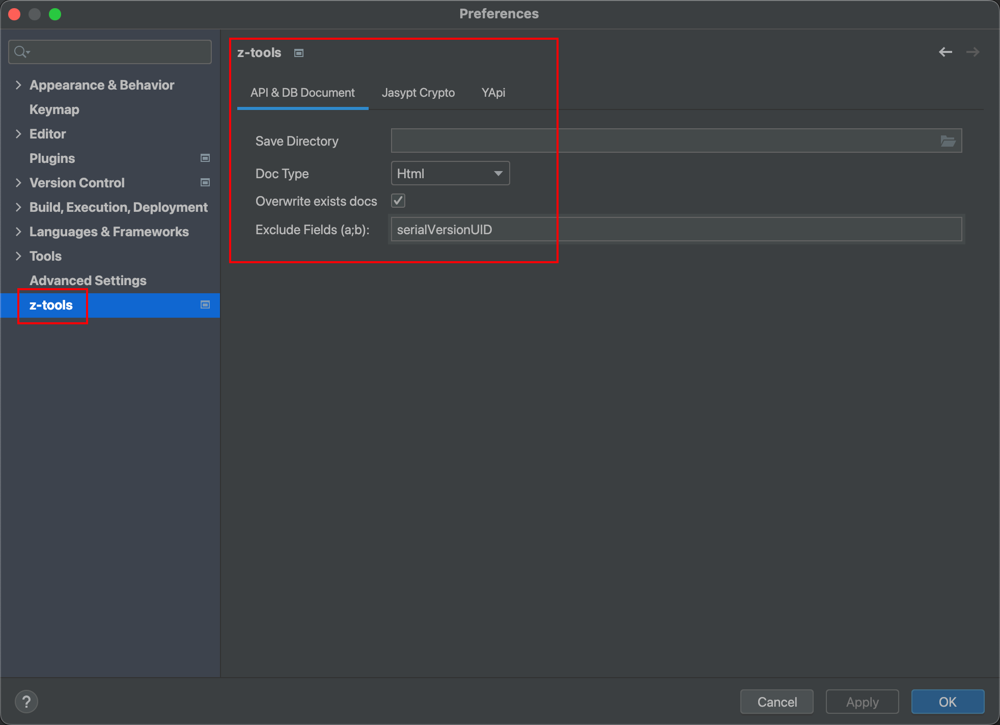

# zTools

面向 Java / Spring 的 IntelliJ IDEA 插件：在编辑器里生成接口文档、复制 JSON / cURL、搜索 Restful、上传 YApi、Jasypt 加解密、导出库表文档、生成内部 Builder

有问题或 Bug 请留言，会尽快处理

**最低 IDEA 版本：2022.1.1**（需安装 Java 插件）

仓库：[GitHub](https://github.com/zhanglinweigithub/zTools) · [Gitee](https://gitee.com/linwei-zhang/z-tools)

## 能做什么

| 功能 | 入口 | 说明 |
| --- | --- | --- |
| [生成接口文档](z-tools-apidoc/README.md) | 右键 **Generate Api Doc** | MarkDown / Html / Word |
| [拷贝 JSON](z-tools-copyjson/README.md) | 右键 **Copy Json** | 类 → 带注释的示例 JSON |
| [拷贝 cURL](z-tools-copycurl/README.md) | 右键 **Copy CURL** | Mapping 方法 → 可执行 curl |
| [搜索 Restful](z-tools-restful/README.md) | **Ctrl + \\** | 按路径跳转 Spring / Feign 接口 |
| [上传 YApi](z-tools-yapi/README.md) | 右键 **Upload YApi** | 方法或整个 Controller |
| [Jasypt 加解密](z-tools-jasyptcrypto/README.md) | 右键 **Jasypt Crypto** | `ENC(...)` 加解密、整文件解密 |
| [生成数据库文档](z-tools-dbdoc/README.md) | **Tools → Generate DB Doc** | 读 `zTools.yaml` 连 MySQL |
| [生成 Builder](z-tools-generatebuilder/README.md) | **Generate → Builder** | 内部 Builder，支持 record 与继承 |

## 如何配置

[配置与持久化](z-tools-configure/README.md)（Settings → **z-tools**）

## 快速开始

1. 安装插件后打开一个 Spring 工程
2. **Settings → z-tools**
   - 文档：保存目录、Html / MarkDown / Word
   - Jasypt：至少一个密码（要用加解密时）
   - YApi：Server URL + Token，点 Resolve
3. 在 Controller 方法上右键试一次 **Generate Api Doc** 或 **Copy CURL**
4. 库表文档需在 `src/main/resources/zTools.yaml` 单独写数据源，不要依赖 `application.yml`

项目级配置写在 `.idea/zTools.xml`（可能含密码和 Token，提交前请确认）

全局请求前缀、端口来自 `application.yaml` / `.yml` / `.properties`（`src/main/resources` 优先）

