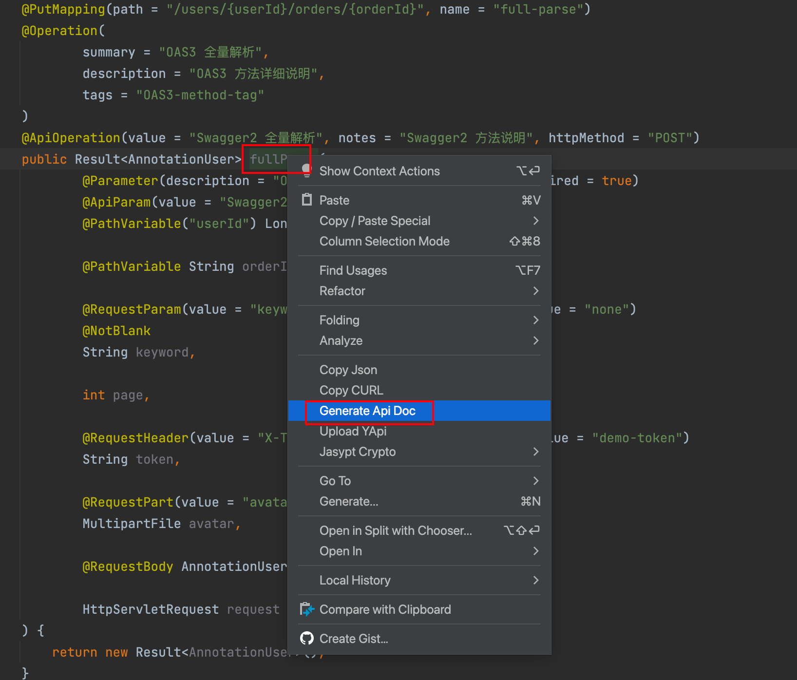
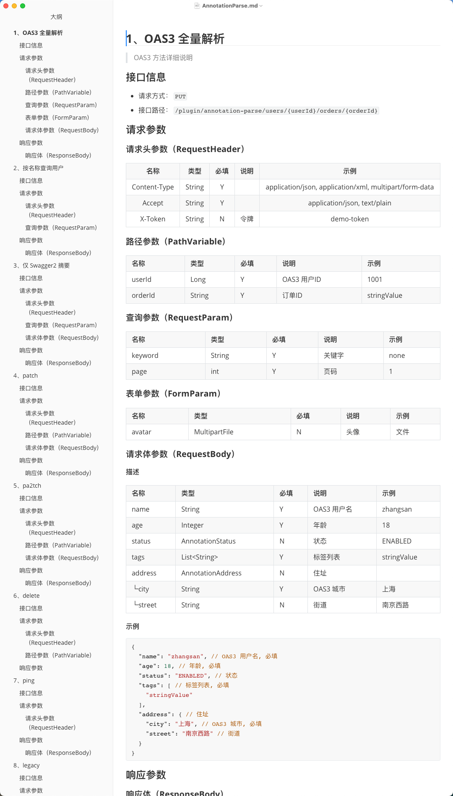
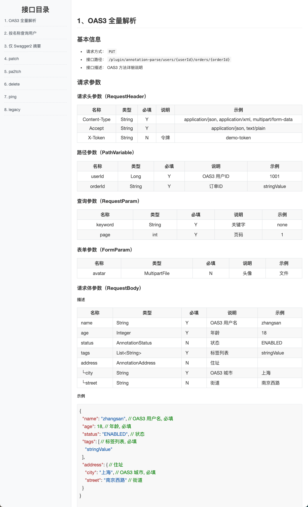

# 生成接口文档（z-tools-apidoc）

从 Spring MVC Controller 解析接口，生成 **MarkDown / Html / Word** 文档。光标在方法上只生成当前接口

光标在类上（不在某个方法内）生成该 Controller 的全部 Mapping 接口

## 入口

编辑器右键 → **Generate Api Doc**



## 使用步骤

1. 打开 Java Controller
2. 把光标放到 **某个 Mapping 方法名称上**，或放到 **类名 / 类声明处**（不要落在某个方法里）
3. 右键选择 `Generate Api Doc`
4. 成功后右下角提示 `Generate Api document successfully!`

未配置保存目录时，文件写到项目下 `target/_docs/`。**IDEA 有时不刷新该目录**，可到磁盘上查看

文档类型、保存目录、是否覆盖，在 **Settings → z-tools → API & DB Document** 中配置，详见 [配置模块](../z-tools-configure/README.md)

## 文档里有什么

每条接口包含：

- 标题与描述（OpenAPI / Swagger 注解或 JavaDoc）
- HTTP 方法、路径（含 `server.servlet.context-path` 或 `spring.mvc.servlet.path` 前缀）
- Path / Query / Header / Body / Form 参数表（名称、类型、必填、说明、示例）
- 请求 / 响应示例 JSON
- `void` / `Void` 返回值不展示响应参数一节

`@RequestMapping` 未写 `method` 时，文档动词为 `GET, POST, PUT, PATCH, DELETE`。

## 示例

```java
@RestController
@RequestMapping("/users")
public class UserController {

    /**
     * 创建用户
     */
    @PostMapping
    public User create(@RequestBody User user) {
        return user;
    }

    /**
     * 按 ID 查询
     */
    @GetMapping("/{id}")
    public User get(@PathVariable Long id,
                    @RequestParam(required = false) String keyword) {
        return null;
    }

    @GetMapping("/ping")
    public String ping() {
        return "ok";
    }
}
```

```java
@Schema(description = "用户")
public class User {
    @Schema(description = "用户名", example = "alice")
    @NotBlank
    private String name;

    @Schema(description = "年龄", example = "18")
    private Integer age;

    /** 状态 */
    private Status status;
}

public enum Status { ENABLED, DISABLED }
```

生成结果要点：

- `POST /users`：Body 为 User 字段表 + JSON 示例；`name` 必填；`age` 示例为数字 `18`（不是字符串）；`status` 示例为枚举第一个常量 `ENABLED`
- `GET /users/{id}`：`id` 为 Path 且默认必填；`keyword` 为 Query
- `GET /users/ping`：响应是标量时名称显示为 `-`；无字段可展开
- 无描述的接口不输出空描述段落（HTML）





## 参数如何归类

| 注解 / 情况 | 文档位置 |
| --- | --- |
| `@PathVariable` | Path |
| `@RequestParam` 或未写绑定注解的普通参数 | Query |
| `@RequestHeader` | Header |
| `@RequestBody` | JSON Body |
| `@RequestPart` / `MultipartFile` | Form / 文件 |

必填规则（文档侧）：

- Path：除非显式 `required = false`，否则为必填
- Query：隐式参数默认必填；写了 `required = false` 或 `defaultValue` 则为非必填
- `@NotNull` / `@NotBlank` / `@NotEmpty`，以及 OAS/Swagger 标明必填时，仍视为必填

## 注解支持

Spring Web：`@Controller`、`@RestController`、`@RequestMapping`、`@GetMapping`、`@PostMapping`、`@PutMapping`、`@DeleteMapping`、`@PatchMapping`、`@RequestBody`、`@RequestParam`、`@PathVariable`、`@RequestHeader`、`@RequestPart`

Feign：`@RequestLine`

OpenAPI 3 / Swagger 2：`@Operation`、`@ApiOperation`、`@Schema`、`@ApiModel`、`@ApiModelProperty`、`@Parameter`、`@ApiParam`、`@Tag`、`@Api`

校验：`@NotNull`、`@NotBlank`、`@NotEmpty` 等（javax / jakarta）

说明与示例优先级：OpenAPI → Swagger → Spring → 校验 → JavaDoc → 类型默认值

## 注意事项

1. 必须是带 Controller 注解的类，方法必须有 Mapping，否则会提示不是 RestApi / Controller
2. `static` 字段和 `serialVersionUID` 不会进入字段树
3. 循环引用的嵌套对象在 JSON 里写成 `{}`，并标注「同外层」
4. 设置页 **Exclude Fields** 用分号分隔字段名，默认排除 `serialVersionUID`
5. 中文乱码时把 IDEA 全局编码设为 UTF-8
6. 全局请求前缀来自 `application.yaml` / `.yml` / `.properties`，优先 `src/main/resources`；`server.servlet.context-path` 优先于 `spring.mvc.servlet.path`。改完配置请保存文件后再生成
