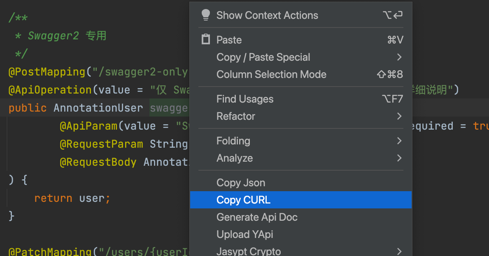

# 拷贝 cURL（z-tools-copycurl）

把 Spring Mapping 方法复制成可执行的 `curl`，可直接粘贴到终端或导入 Postman

## 入口

编辑器右键 → **Copy CURL**



## 使用步骤

1. 打开 Controller，光标放到 **某个 Mapping 方法** 内
2. 右键选择 `Copy CURL`
3. 粘贴到终端或 Postman

成功提示：`Copy CURL successfully!` 
光标不在方法上会提示 `Please choose a method!`；不是 Mapping 方法会提示 `The method is not a RestApi!`

## 生成规则

- URL：`http://127.0.0.1:{server.port}` + 全局前缀 + 类路径 + 方法路径
- 端口来自 `application.*` 的 `server.port`，未配置则为 `8080`
- 全局前缀：`server.servlet.context-path`，否则 `spring.mvc.servlet.path`
- HTTP 动词：方法 Mapping 优先，其次类 Mapping，都没有则 `GET`
- `{id}` 这类 Path 变量会用参数示例值替换
- Query、Header、JSON Body、表单会按注解拼进命令

## 示例

```java
@RestController
@RequestMapping("/users")
public class UserController {

    @PostMapping("/{id}")
    public User update(@PathVariable Long id, @RequestBody User user) {
        return user;
    }
}
```

```java
public class User {
    private String name;
}
```

若 `server.port=8080` 且未配 context-path，剪贴板内容类似：

```bash
curl --location --request POST 'http://127.0.0.1:8080/users/0' \
--header 'Content-Type: application/json' \
--data '{
  "name": "stringValue"
}'
```

## 注意事项

1. 必须在具体方法上触发，不能只点类名
2. 改完 `application.yml` 的端口或 context-path 后请保存，再复制 curl
3. 多模块工程里插件优先读 `src/main/resources` 下的 `application.yaml` > `.yml` > `.properties`
