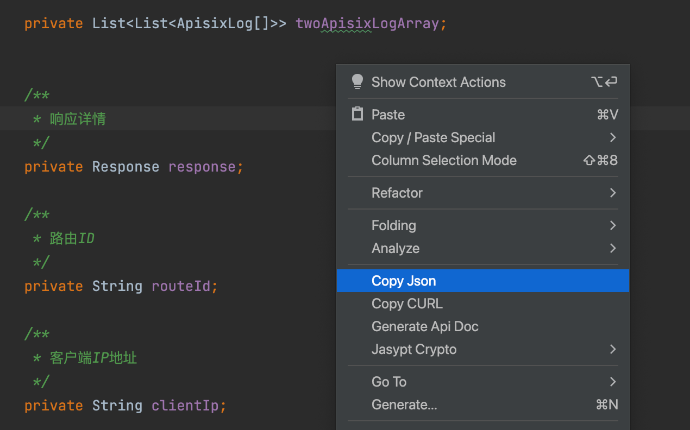

# 拷贝 JSON（z-tools-copyjson）

把光标所在 Java 类转成带行注释的示例 JSON，写入系统剪贴板。支持嵌套对象、泛型、继承字段、枚举和循环引用

## 入口

编辑器右键 → **Copy Json**



## 使用步骤

1. 打开任意 Java 类（不必是 Controller）
2. 光标放在类范围内
3. 右键选择 `Copy Json`
4. 到 Postman、YApi、聊天窗口等处粘贴

成功提示：`Copy Json successfully!`

## 示例

```java
/**
 * 学生
 */
public class Student {

    /** 姓名 */
    @NotNull
    private String studentName;

    private Long age;

    private String address;

    /** 状态 */
    private Status status;

    /** 自引用 */
    private Student studentInfo;
}

public enum Status { ENABLED, DISABLED }
```

生成大致如下：

```json
{
  "studentName": "stringValue", // 姓名, 必填
  "age": 0,
  "address": "stringValue",
  "status": "ENABLED",
  "studentInfo": {} // 同外层
}
```

普通类型（如光标在 `String` 包装类上且没有字段）会直接给出类型默认值，例如 `"stringValue"`。纯枚举类会复制第一个常量名

## 默认值与注释

- 字段名用源码名
- 行注释来自字段 JavaDoc；有 `@NotNull` / `@NotBlank` / `@NotEmpty` 时追加「必填」
- 数字、字符串、时间、UUID 等使用插件内置占位值（如 `String` → `stringValue`，`Integer` → `0`）
- 枚举：取第一个枚举常量
- 循环引用：值为 `{}`，注释「同外层」

## 注意事项

1. 只支持 Java 类文件，光标不在类内会提示失败
2. 默认忽略 `static` 字段（含 `serialVersionUID`）
3. 与接口文档的 JSON 略有不同：Copy Json 用源码字段名，必填只看校验注解，说明只用 JavaDoc
