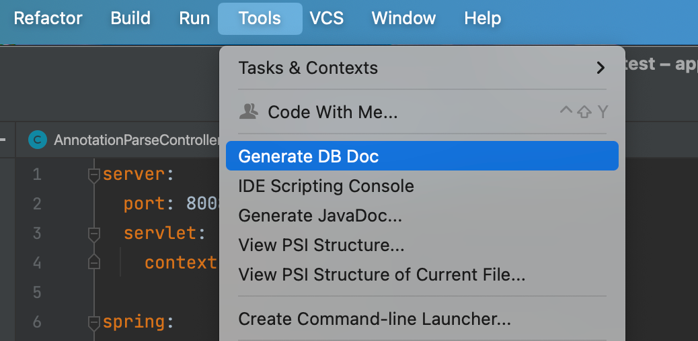
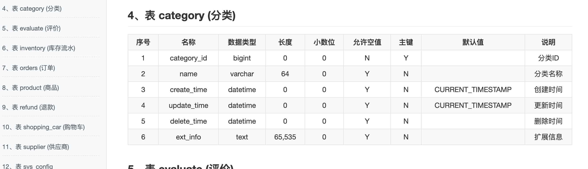

# 生成数据库文档（z-tools-dbdoc）

读取项目里的 `zTools.yaml`（或 yml / properties）数据源配置，连接数据库，导出表结构文档。支持 **MarkDown / Html / Word**。

## 入口

菜单 **Tools → Generate DB Doc**



## 使用步骤

1. 在工程 `src/main/resources` 下放好 `zTools.yaml`（见下方示例）
2. 在 **Settings → z-tools → API & DB Document** 选好文档类型和保存目录
3. 点击 `Tools → Generate DB Doc`
4. 成功提示 `Generate DataBase document successfully!`

未配置保存目录时，输出到 `{项目根}/target/_docs/{库名}.md|html|doc`



## 数据源配置

插件 **不会** 读 Spring 的 `application.yml` 里的数据源，只读插件自己的 `zTools.*` 文件，避免误连生产库

查找顺序：`zTools.yaml` > `zTools.yml` > `zTools.properties`，优先 `src/main/resources`

```yaml
# src/main/resources/zTools.yaml
spring:
  datasource:
    driver-class-name: com.mysql.cj.jdbc.Driver
    url: jdbc:mysql://127.0.0.1:3306/todo-manager?serverTimezone=Asia/Shanghai&useTimezone=true&characterEncoding=utf8mb4&useSSL=false&allowPublicKeyRetrieval=true
    username: root
    password: your-password
```

```properties
# src/main/resources/zTools.properties
spring.datasource.driver-class-name=com.mysql.cj.jdbc.Driver
spring.datasource.url=jdbc:mysql://127.0.0.1:3306/todo-manager?serverTimezone=Asia/Shanghai
spring.datasource.username=root
spring.datasource.password=your-password
```

缺任何一项都会提示：`The 【"…"】 config not found in file [ zTools.yaml ]`

## 支持的数据库

当前仅 **MySQL**（`com.mysql.cj.jdbc.Driver` / `jdbc:mysql://...`）

## 注意事项

1. 改完 `zTools.yaml` 后请保存；读到的仍是旧值时，保存 / 重新构建后再生成
2. 多模块都有 `zTools.yaml` 时，读到的不一定是当前业务模块那一份
3. 本机要能连上该 URL（与 IDEA 运行环境同一网络），并已具备 JDBC 驱动（IDEA 插件侧按驱动类名匹配方言；实际连库走对应实现）
4. 库中没有任何表时提示 `There are no tables in the database`
5. 文档类型与是否覆盖走设置页，与接口文档共用同一套文档配置
