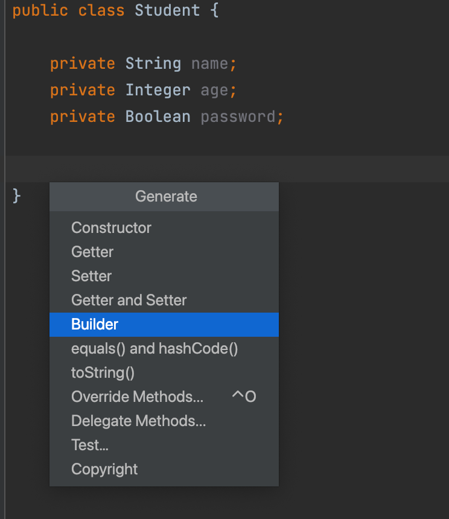

# 生成内部 Builder（z-tools-generatebuilder）

为 Java 类（含 `record`）生成内部静态 Builder。普通类可勾选字段；record 使用全部组件字段，不弹选择框

## 入口

- `Alt + Insert`（macOS 多为 `Command + N`）→ **Builder**
- 或编辑器右键 → **Generate → Builder**

菜单位于 Getter/Setter 附近。当前文件不是带实例字段的 Java 类时，菜单不出现



## 使用步骤

1. 打开目标类，光标放在类体内
2. 打开 Generate 菜单，选择 `Builder`
3. **普通类**：勾选要进入 Builder 的字段；可选 **use lite builder**
4. **record**：直接生成，包含全部组件
5. 确认后在类内插入全参构造、`builder()` 和内部 `Builder`

### use lite builder

- **勾选**：轻量 Builder，无 `C/B` 泛型，适合简单类、不打算被子类扩展
- **不勾选**：带泛型的 Builder，便于子类继承父类 Builder（需按下面示例改子类代码）

选项会记住上次勾选

## 示例：普通类（lite）

生成前：

```java
public class Student {
    private String name;
    private Integer age;
    private Boolean password;
}
```

勾选 lite 后：

```java
public class Student {

    private String name;
    private Integer age;
    private Boolean password;

    public Student(String name, Integer age, Boolean password) {
        this.name = name;
        this.age = age;
        this.password = password;
    }

    public static Builder builder() {
        return new Builder();
    }

    public static class Builder {
        private String name;
        private Integer age;
        private Boolean password;

        public Builder name(String name) {
            this.name = name;
            return this;
        }

        public Builder age(Integer age) {
            this.age = age;
            return this;
        }

        public Builder password(Boolean password) {
            this.password = password;
            return this;
        }

        public Student build() {
            return new Student(name, age, password);
        }
    }
}
```

## 示例：带泛型、支持继承

不勾选 lite 时，父类类似：

```java
public static Builder<?, ?> builder() {
    return new Builder<>();
}

public static class Builder<C extends Student, B extends Builder<C, B>> {
    protected String name;
    // ...
    public B name(String name) {
        this.name = name;
        return (B) this;
    }

    public C build() {
        return (C) new Student(name, age, password);
    }
}
```

### 子类需要手改的四处

父类直接生成即可。子类生成后再改：

1. `extends Student`
2. 构造器 `super(...)` 调用父类构造
3. `Builder` 声明 `extends Student.Builder<C, B>`
4. `build()` 里 `new ChildStudent(super.name, …, 子类字段…)`

```java
public class ChildStudent extends Student {

    private String nickName;
    private String city;

    public ChildStudent(String name, Integer age, Boolean password,
                        String nickName, String city) {
        super(name, age, password);
        this.nickName = nickName;
        this.city = city;
    }

    public static Builder<?, ?> builder() {
        return new Builder<>();
    }

    public static class Builder<C extends ChildStudent, B extends Builder<C, B>>
            extends Student.Builder<C, B> {
        protected String nickName;
        protected String city;

        public B nickName(String nickName) {
            this.nickName = nickName;
            return (B) this;
        }

        public B city(String city) {
            this.city = city;
            return (B) this;
        }

        @Override
        public C build() {
            return (C) new ChildStudent(super.name, super.age, super.password,
                    nickName, city);
        }
    }
}
```

使用：

```java
ChildStudent child = ChildStudent.builder()
        .name("Ada")
        .age(10)
        .nickName("A")
        .city("Shanghai")
        .build();
```

## 示例：record

```java
public record Apple(String name, String age) {
}
```

生成后包含 `builder()` 与内部 `Builder`，`build()` 调用 `new Apple(name, age)`。record 没有 lite/泛型选项

## 注意事项

1. 只处理非 `static` 实例字段
2. 取消对话框或一个字段都不选，不会改代码
3. 子类继承 Builder 不会全自动正确，需要按上面四处调整
