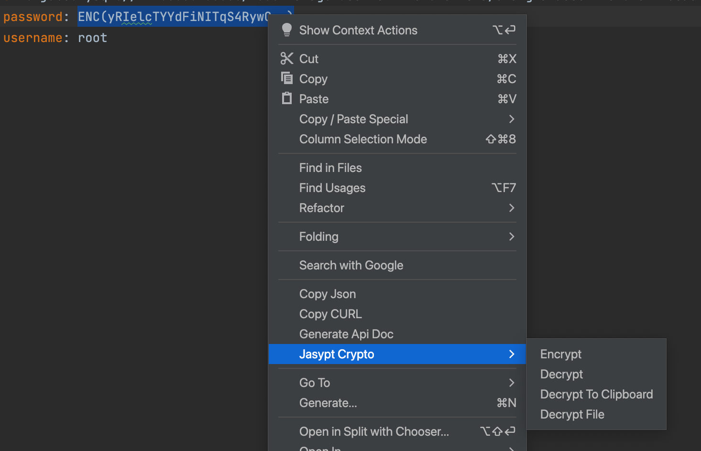

# Jasypt 加解密（z-tools-jasyptcrypto）

在编辑器里用 Jasypt PBE 加密 / 解密文本，默认包裹为 Spring 常见的 `ENC(...)`。适合 `application.yml` 里的密码、密钥等敏感项

## 入口

编辑器右键 → **Jasypt Crypto**

| 菜单 | 作用 |
| --- | --- |
| **Encrypt** | 把选中明文加密，写回为 `ENC(密文)` |
| **Decrypt** | 把选中的 `ENC(...)` 或裸密文解密，写回编辑器 |
| **Decrypt To Clipboard** | 解密选区，复制到剪贴板，不改文件 |
| **Decrypt File** | 扫描整个文件，把所有 `ENC(...)` 还原为明文 |



## 使用前配置

**Settings → z-tools → Jasypt Crypto**

至少填一个 **Password**。密码、固定盐、固定 IV 都可以写多个，用 `;` 分隔：加密时弹窗选择本次用的那一组；解密时按组合尝试直到成功

其它项需与运行时 Jasypt（如 Spring `jasypt.encryptor.*`）保持一致：

| 项 | 含义 | 默认 |
| --- | --- | --- |
| Algorithm | PBE 算法 | `PBEWITHMD5ANDDES` |
| Iterations | 密钥派生迭代次数 | `1000` |
| Output Type | `base64` / `hexadecimal` | `base64` |
| Enc Wrapper | 密文包裹，`%s` 为密文 | `ENC(%s)` |
| Salt Generator | 见下方盐 / IV | `ZeroSaltGenerator` |
| Salt Value | 仅 Fixed 盐时出现；多个用 `;` | 空 |
| IV Generator | 见下方盐 / IV | `NoIvGenerator` |
| IV Value | 仅 Fixed IV 时出现；多个用 `;` | 空 |

配置写在项目 `.idea/zTools.xml`

未配密码时操作会提示：`Password is required. Please configure it in Settings > z-tools.`  
选了 Fixed 盐 / IV 但没填对应值时，加密会提示需要在设置里填写

## 盐 / IV 生成器

| Salt Generator | 说明 |
| --- | --- |
| `ZeroSaltGenerator` | 固定零盐，同一明文多次加密结果相同 |
| `RandomSaltGenerator` | 随机盐，盐写在密文里，每次密文不同 |
| `ByteArrayFixedSaltGenerator` | 固定字节盐，需填 **Salt Value**（优先按 hex，否则 UTF-8） |
| `StringFixedSaltGenerator` | 固定字符串盐，需填 **Salt Value** |

| IV Generator | 说明 |
| --- | --- |
| `NoIvGenerator` | 不生成 IV，给 `PBEWITHMD5ANDDES` 等不含 IV 的算法 |
| `RandomIvGenerator` | 随机 IV，IV 写在密文里 |
| `ByteArrayFixedIvGenerator` | 固定字节 IV，需填 **IV Value**（优先按 hex，否则 UTF-8） |
| `StringFixedIvGenerator` | 固定字符串 IV，需填 **IV Value** |

选中 Fixed 类型后，设置页才会显示对应的值输入框。ByteArray 可写十六进制（可带 `0x`、空格），对不上 hex 规则时按 UTF-8。长度必须满足当前算法（例如 DES 盐约 8 字节；AES 类算法盐和 IV 通常各 16 字节）

`Zero` / `Random` / `NoIv` 不使用值输入框，也不参与多值枚举

## 示例

`application.yml`：

```yaml
spring:
  datasource:
    password: 123456
```

1. 选中 `123456`
2. 右键 **Jasypt Crypto → Encrypt**
3. 变成类似：

```yaml
spring:
  datasource:
    password: ENC(xK8a...)
```

选中整段 `ENC(xK8a...)`，**Decrypt** 会写回 `123456`；**Decrypt To Clipboard** 则只把明文放到剪贴板

整份配置要一次性解开时，打开该文件（不必选中），**Decrypt File**：所有能解开的 `ENC(...)` 变成明文，解不开的保持原样

## 多环境密码 / 盐 / IV

生成、测试、开发若各自使用不同的 **Fixed** 密码、盐、IV，可写在同一份设置里：

```
Password:    genPwd;testPwd;devPwd
Salt Value:  genSalt12;testSalt1;devSalt12
IV Value:    genIvValue16chars;testIvValue16cha;devIvValue16chars
```

（上表为形态示意，实际盐 / IV 长度须满足算法）

- **加密**：密码、盐、IV 里只要有一项多于一个，就弹出选择框，只显示需要选的下拉，选中的三项一起用来加密
- **解密 / Decrypt File**：按「密码 × 盐 × IV」组合依次尝试，解出一组就停。同一文件里混有不同环境的 `ENC(...)` 也能分别解开
- 配错或全部失败：提示 `Decryption failure.`，不会返回乱码明文

只有一项是多值时（例如密码仍是一个、盐有三个），弹窗只出现对应下拉

## 注意事项

1. Encrypt / Decrypt / Decrypt To Clipboard 需要先选中文本；Decrypt File 对当前打开的整个文档生效
2. 算法、盐、IV、迭代次数、输出编码必须与解密端一致，否则会 `Decryption failure.`
3. `PBEWITHMD5ANDDES` 不要配随机 IV，应使用 `NoIvGenerator`
4. 不要把真实生产密码、盐、IV 写进 README、截图或提交到 Git；`.idea/zTools.xml` 含这些值时请自行忽略或勿提交
