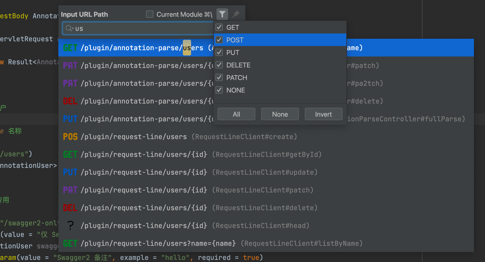

# 搜索并跳转 Restful 接口（z-tools-restful）

按 URL 搜索当前工程里的 Spring MVC / Feign 接口，选中后跳转到对应方法。类似 Go To Class，但是搜路径

## 入口

快捷键 **Ctrl + \\**（反斜杠）

也可在 Keymap 里搜索 `go-to-restful` 自行改键

## 使用步骤

1. 任意位置按下 `Ctrl + \`
2. 搜索框上方的 **Prefix** 下拉可选全局请求前缀，默认第一项；始终包含 `/`（无额外前缀），有其它前缀时 `/` 在最后
3. 输入路径片段，如 `user`、`/api/users/{id}`
4. 点前缀行右侧漏斗，按 **HTTP 方法**（GET / POST / …）缩小范围；可勾选仅当前模块
5. 回车跳转到方法源码

列表中的路径会拼上当前选中的前缀。一个 IDEA 窗口里打开了多个项目、前缀不同时，在下拉里切换即可

## 识别范围

- Spring：`@Controller` / `@RestController` 上的 `@RequestMapping`、`@GetMapping` 等
- Feign：`feign.RequestLine`。

## 全局请求前缀

只扫描各模块 **生产 resources**（`src/main/resources`）下的 `*.yaml` / `*.yml` / `*.properties`，不再全工程按文件名索引。每个文件中：

1. 先读 `server.servlet.context-path`（也认 `contextPath`）
2. 没有再读 `spring.mvc.servlet.path`

多份配置、多个 YAML 文档里的前缀会去重后进入下拉，默认选中第一项。下拉**始终包含** `/`（无额外前缀）；有其它前缀时 `/` 放在最后。

例如某个项目 context-path 为 `/api`，方法 Mapping 为 `/users/{id}`，选中该前缀后列表显示 `/api/users/{id}`

## 注意事项

1. 只看 `src/main/resources`（以及模块的 Java Resource Root），不读 test 资源，并跳过 `target` / `build` / `.git` 等目录
2. 修改配置后请保存文件再搜
3. YAML 请规范缩进，否则可能解析不到前缀
4. 前缀按扫描顺序去重；需要搜另一个子项目时，在 Prefix 下拉里切换
